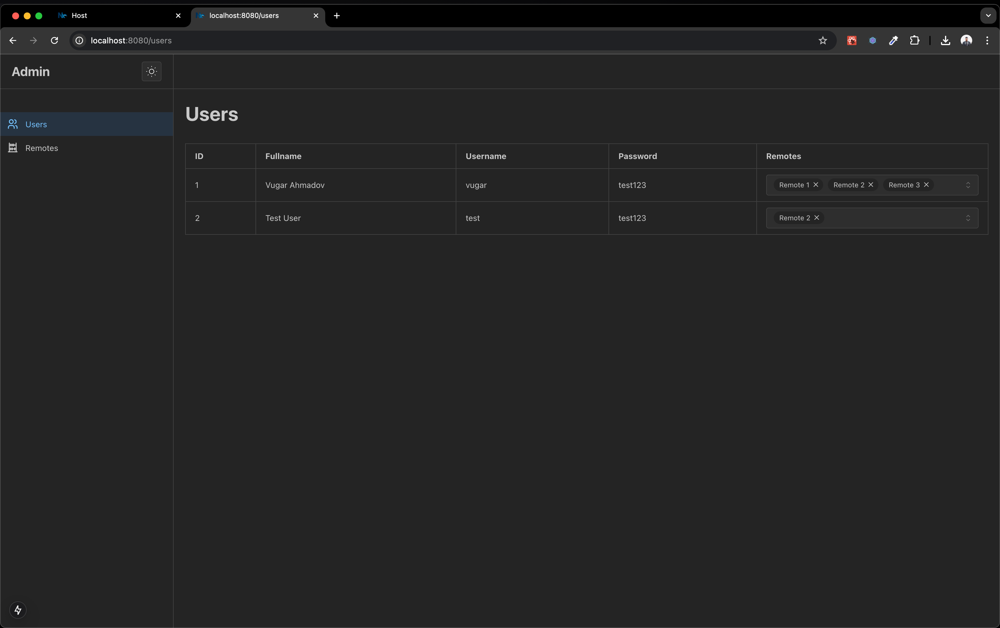
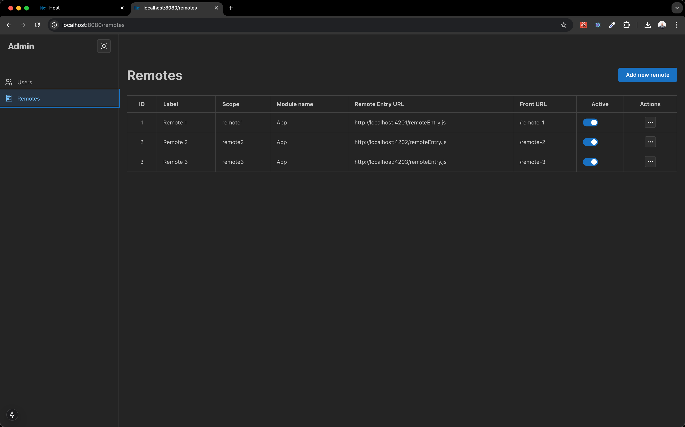
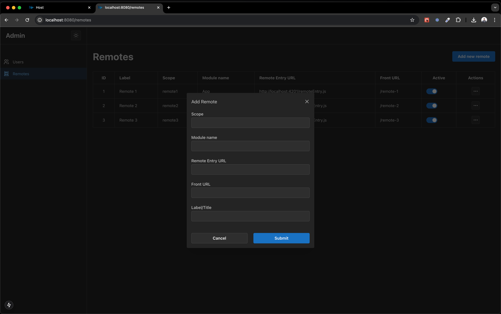
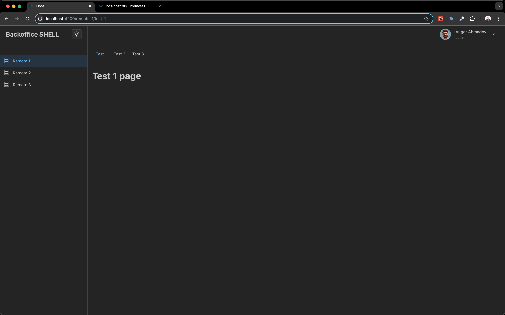
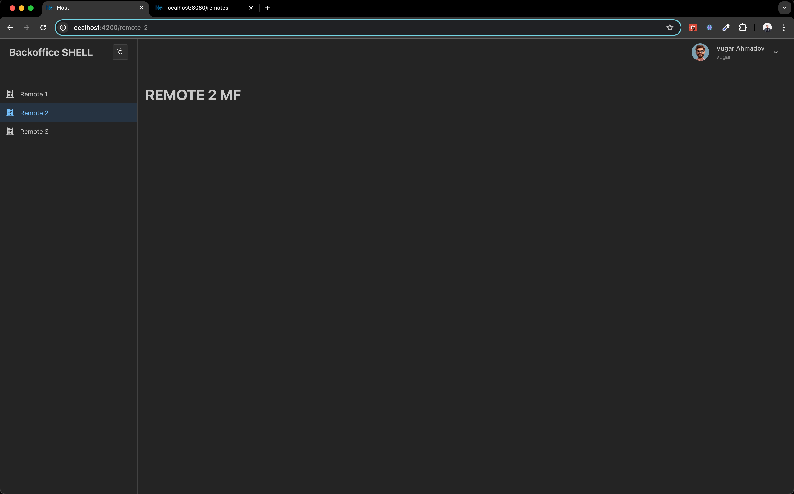
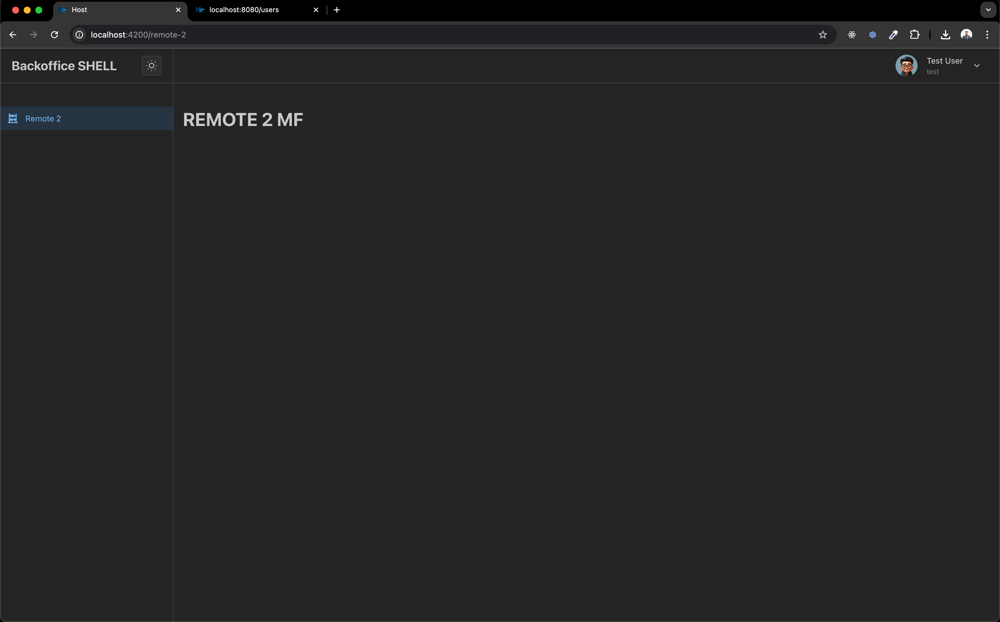

# DynamicModuleFederation

This workspace demonstrates Dynamic Module Federation using Nx and React. It showcases how to implement runtime module federation where remote modules are loaded dynamically based on configuration.

## Key Features

- Dynamic loading of federated modules at runtime
- Centralized configuration management (Admin) for remote apps
- Multiple independent applications working together
- Built with Nx for optimal monorepo management

## Project Structure

```
apps/
  ├── admin/            # Admin application for managing remote configurations
  └── mfs/
      ├── host/         # Host application that dynamically loads remote modules
      ├── remote-1/     # First remote application
      └── remote-2/     # Second remote application
      └── remote-3/     # Third remote application
```

<br>

## Module Federation Setup

To run the federated applications:

```sh
# Install nx globaly
sudo npm install -g nx

# Install packages
pnpm i

# change .env.sample to .env
mv .env.sample .env

# Start admin application
nx serve admin

# Start host application
nx serve host

# Start all remotes
nx run-many -t serve remote-1 remote-2 remote-3
```

<br>

### Admin application

The admin application will be available at [http://localhost:8080](http://localhost:8080)
<br>
<br>

### Host apllication

The host application will be available at [http://localhost:4200](http://localhost:4200)

<br>

we have 2 users for test
| Username | Password |
| -------- | ------- |
| vugar | test123 |
| test | test123 |
<br>

To add new remote to host application

- go to this url [http://localhost:8080/remotes](http://localhost:8080/remotes).
- click to `Add new remote` button
- fill the form and submit
- go to this url [http://localhost:8080/users](http://localhost:8080/users).
- add remote to user-remotes
- copy `remote-3` folder and change its name to whatever you named when you create the remote
- in `rsbuild.config.ts` file change `name` with Scope that you provided.

## Screenshots

Admin application





Host application - with `vugar` user



Host application - with `test` user

